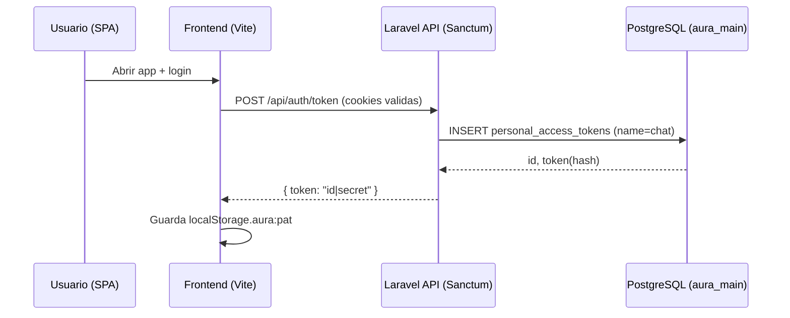
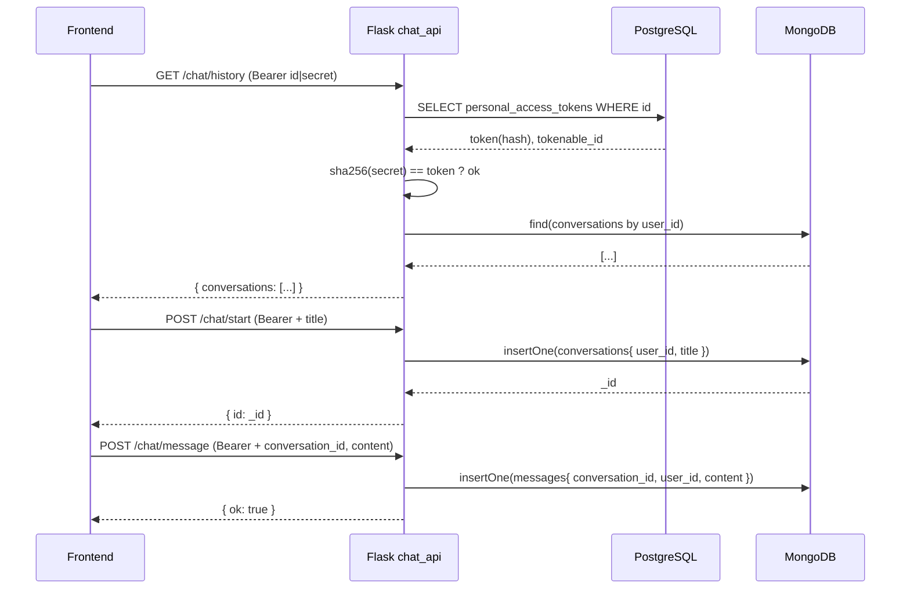

# Aura_dev — Integracion Chat (Laravel + Flask + MongoDB)

Este documento detalla, paso a paso y con diagramas, como se unifico la identidad de usuarios en PostgreSQL (Laravel/Sanctum) con el historial de conversaciones en MongoDB (Flask), de modo que cada conversacion se asocie al `user_id` real, como en ChatGPT.

Nota: donde veas rutas de archivos, puedes hacer clic en ellas desde tu IDE para abrir el archivo.

## Resumen Rapido
- Identidad y autenticacion en PostgreSQL (Laravel + Sanctum).
- Conversaciones y mensajes en MongoDB (microservicio Flask `chat_api`).
- El frontend obtiene un token personal (Sanctum PAT: `id|secret`) y lo envia en `Authorization: Bearer ...` a Flask.
- Flask valida el token contra PostgreSQL y usa el `user_id` resultante para leer/escribir en Mongo.

## Arquitectura (Vista General)

```
+--------------------+         +----------------------+         +--------------------+
|  React / Vite SPA  |  PAT    |      Laravel API     |  PGSQL  |    PostgreSQL      |
|  (frontend/)       +--------->  (backend/, Sanctum) +--------->  aura_main          |
|                    |         |                      |         |  users, PAT tokens |
+---------+----------+         +----------+-----------+         +----------+---------+
          |                               |                                   ^
          | Bearer PAT                    |                                   |
          v                               |                                   |
+---------+----------+                    |                                   |
|    Flask chat_api  |    Mongo CRUD      |                                   |
| (microservices/    +--------------------+                                   |
|  chat_service/)    |                                                        |
+---------+----------+                                                        |
          |                                                                 
          v                                                                 
+---------+----------+                                                        
|       MongoDB      |                                                        
|     aura_chat      |                                                        
| conversations,msgs |
+--------------------+
```

Captura sugerida: `docs/images/overview.png` (diagrama de servicios y red `aura_network`).

---

## Diagramas de Secuencia (Mermaid)

### Emision de Token (PAT)


### Inicio y Mensajeria del Chat


Capturas sugeridas:
- `docs/images/token_issue.png` (respuesta JSON de `/api/auth/token`).
- `docs/images/chat_history.png` (historial vacio y luego con items).
- `docs/images/mongo_conversations.png` (coleccion `conversations` en Mongo Express).

---

## Modelos y Esquemas

### Sanctum (PostgreSQL)
Tabla: `personal_access_tokens`
- id (bigint, PK)
- tokenable_type (string)
- tokenable_id (bigint -> `users.id`)
- name (string, "chat")
- token (char(64), SHA256 del secret)
- abilities (text|null)
- last_used_at (timestamp|null)
- expires_at (timestamp|null)
- created_at, updated_at

### MongoDB (aura_chat)
- conversations
```json
{
  "_id": { "$oid": "..." },
  "user_id": "<users.id en PG>",
  "title": "Nueva conversacion",
  "created_at": { "$date": "..." },
  "updated_at": { "$date": "..." },
  "last_message_at": { "$date": "..." }
}
```
- messages
```json
{
  "_id": { "$oid": "..." },
  "conversation_id": { "$oid": "..." },
  "user_id": "<users.id>",
  "role": "user|assistant|system",
  "content": "...",
  "created_at": { "$date": "..." }
}
```
Indices:
- conversations: `{ user_id: 1, last_message_at: -1 }`
- messages: `{ conversation_id: 1, created_at: 1 }`

Capturas sugeridas:
- `docs/images/postgres_personal_access_tokens.png` (tabla tokens en PG).
- `docs/images/mongo_messages.png` (coleccion `messages` ordenada por fecha).

---

## Mapa de Codigo (referencias)
- Emision PAT: backend/app/Http/Controllers/Api/TokenController.php:1
- Rutas API: backend/routes/api.php:1
- Bootstrap rutas + Sanctum SPA: backend/bootstrap/app.php:1
- Validacion PAT (Flask): microservices/chat_service/services/auth.py:1
- Endpoints Chat: microservices/chat_service/app.py:1
- CRUD Mongo: microservices/chat_service/services/mongo.py:1
- Asegurar PAT en SPA: frontend/src/lib/auth.ts:1
- Cliente Chat API: frontend/src/lib/chatApi.ts:1
- Creacion automatica de conversacion: frontend/src/pages/Chat/ChatPanel.tsx:1

---

## Topologia de Red (Docker)

```
   +-------------------+       +-------------------+       +------------------+
   |  aura_postgres    |<----->|   chat_api        |<----->|  aura_mongo      |
   |  (5432)           |   ^   |   (5060 public)   |   ^   |  (27017, 8081 UI)|
   +-------------------+   |   +-------------------+   |   +------------------+
            ^              |            ^              |             ^
            |              |            |              |             |
            +--------------+------------+--------------+-------------+
                           Docker network: aura_network (bridge)
```

Captura sugerida: `docs/images/network.png` (salida de `docker ps` + `docker network inspect aura_network`).

---

## Operacion del Frontend
- ensureChatToken() (frontend/src/lib/auth.ts:1)
  - Lee `localStorage.aura:pat`; si falta, llama `POST /api/auth/token` y guarda el token.
- Interceptor chatApi (frontend/src/lib/chatApi.ts:1)
  - Anade `Authorization: Bearer <token>` a cada request.
  - Si 401, limpia el token, solicita uno nuevo y reintenta 1 vez.
- ChatPanel (frontend/src/pages/Chat/ChatPanel.tsx:1)
  - Al pulsar “Nueva conversacion” crea la conversacion en Flask y reemplaza el id temporal por el real (evento `aura:conversation:realized`).

Capturas sugeridas:
- `docs/images/localstorage_token.png` (DevTools -> Application -> Local Storage -> aura:pat).
- `docs/images/network_tab.png` (DevTools -> Network mostrando `Authorization: Bearer ...`).

---

## Verificacion y Pruebas (paso a paso)
1) Autenticacion y token
   - Frontend logueado -> `POST /api/auth/token` devuelve `id|secret`.
   - Ver `localStorage.aura:pat` y que el interceptor anade Authorization.
2) Historial
   - `GET /chat/history` -> 200 `{ conversations: [...] }`.
3) Crear conversacion
   - `POST /chat/start` -> 201 `{ id: ... }`.
   - Revisar Mongo Express para ver el documento.
4) Enviar mensaje
   - `POST /chat/message` -> 201 `{ ok: true }`.
   - Verificar `messages` en Mongo.

Comandos utiles:
```bash
# Token manual (si necesitas probar por Postman con cookies)
curl -i -X POST http://127.0.0.1:8000/api/auth/token \
  -H 'Cookie: XSRF-TOKEN=...; laravel_session=...'

# Historial (con Bearer)
curl -H 'Authorization: Bearer ID|SECRET' http://127.0.0.1:5060/chat/history

# Nuevo chat
curl -X POST -H 'Authorization: Bearer ID|SECRET' \
  -H 'Content-Type: application/json' \
  -d '{"title":"Nueva conversacion"}' \
  http://127.0.0.1:5060/chat/start

# Mensaje
curl -X POST -H 'Authorization: Bearer ID|SECRET' \
  -H 'Content-Type: application/json' \
  -d '{"conversation_id":"<ID>","content":"Hola"}' \
  http://127.0.0.1:5060/chat/message
```

---

## Observabilidad (Logs)
- Flask al validar token:
  - `Validando token id=...`
  - `SHA256 calculado: <hex>`
  - `Hash esperado (Postgres): <hex>`
  - `Usuario autenticado: <user_id>`
  - `Token validado correctamente`
- Flask al consultar historia:
  - `/chat/history -> user_id: <user_id>`
  - `conversaciones recuperadas: N`
- Laravel (issue token): confirmar `route:list` y migracion `personal_access_tokens` creada.

---

## Solucion de Problemas
- 401 en `/chat/*`:
  - Confirmar `localStorage.aura:pat` con formato `id|secret`.
  - `POST /api/auth/token` funciona (cookies, CORS, SANCTUM_STATEFUL_DOMAINS).
  - Ver logs en Flask para `Token mismatch`.
- Token mismatch:
  - Usar el PAT mas reciente (el PAT antiguo no sirve).
  - En PG: `SELECT id, tokenable_id, LEFT(token,8) FROM personal_access_tokens ORDER BY id DESC LIMIT 5;`.
- Conexion Mongo:
  - Variables `MONGO_URI` y `MONGO_DB` correctas; contenedores en `aura_network`.
- CORS / Cookies:
  - Laravel: `config/cors.php` y `.env` (`SANCTUM_STATEFUL_DOMAINS`).
  - Flask: `CORS_ALLOW_ORIGINS` incluye `http://127.0.0.1:5173`.

---

## Seguridad y Mantenimiento
- Revocar tokens en logout (`POST /api/auth/token/revoke`) y borrar `aura:pat`.
- Rotar contrasenas por defecto de Postgres/Mongo antes de produccion.
- No exponer PAT en logs del cliente o URLs.
- Si cambias puertos/origenes, alinea `.env`, `config/sanctum.php`, `config/cors.php` y `VITE_CHAT_API_BASE`.

---

## Checklist de Capturas (agrega en docs/images/)
- overview.png -> diagrama general (servicios y red).
- token_issue.png -> respuesta JSON de `/api/auth/token`.
- localstorage_token.png -> DevTools mostrando `aura:pat`.
- network_tab.png -> DevTools -> Network con header `Authorization`.
- chat_history.png -> SPA con historial cargado.
- mongo_conversations.png -> Mongo Express coleccion `conversations`.
- postgres_personal_access_tokens.png -> Tabla de tokens en PG.
- network.png -> `docker ps` + `docker network inspect aura_network`.

