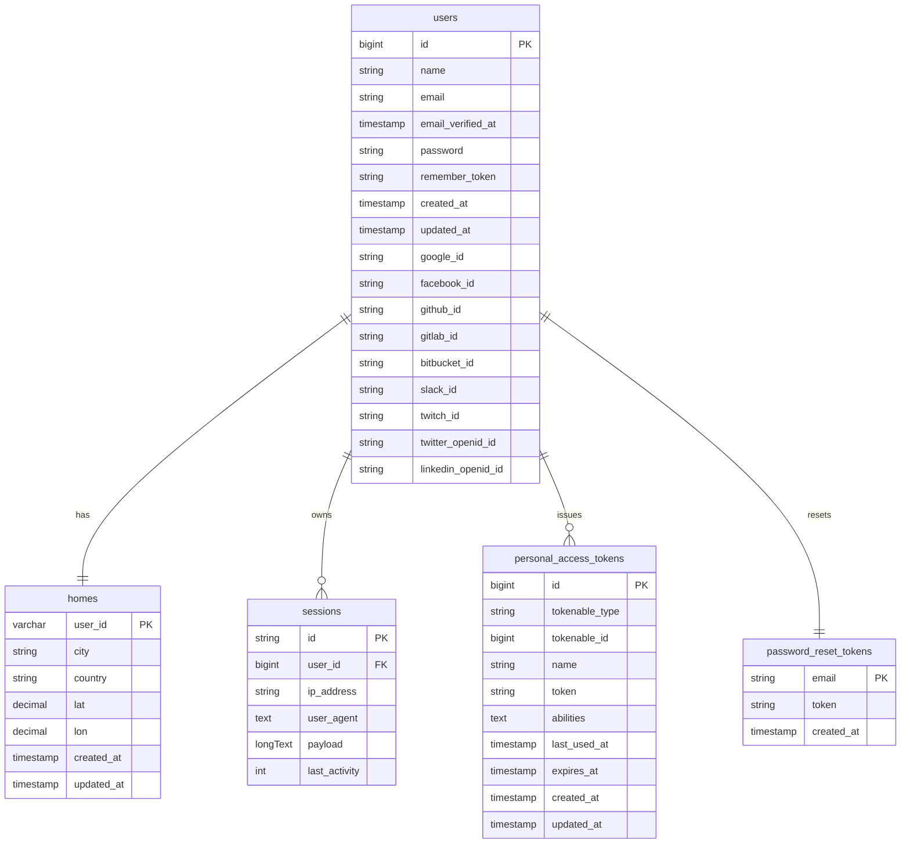

## Base de datos relacional (Postgres / Laravel)

Este proyecto usa PostgreSQL para usuarios, sesiones, tokens y metadatos de ubicación. Las principales tablas relacionales son:

### 1. `users`
| Campo | Tipo | Restricción / descripción |
|---|---|---|
| `id` | `bigint` (auto-incremental) | PK |
| `name` | `varchar` | Nombre completo |
| `email` | `varchar` | Único, correo usado en login |
| `email_verified_at` | `timestamp` | Nullable |
| `password` | `varchar` | Hash bcrypt |
| `remember_token` | `varchar(100)` | Nullable (Laravel) |
| `timestamps` | `created_at` / `updated_at` | Auto |

- **Extensiones (social login)**: `google_id`, `facebook_id`, `github_id`, `gitlab_id`, `bitbucket_id`, `slack_id`, `twitch_id`, `twitter_openid_id`, `linkedin_openid_id` (todos únicos y nullable). Permiten vincular OAuth externos.

### 2. `password_reset_tokens`
| Campo | Tipo | Descripción |
|---|---|---|
| `email` | `varchar` | PK, coincide con `users.email` |
| `token` | `varchar` | Token generado por Laravel |
| `created_at` | `timestamp` | Expira a los X minutos |

Laravel encriptará este token y lo comparará con las solicitudes de reset.

### 3. `sessions`
| Campo | Tipo | Descripción |
|---|---|---|
| `id` | `string` (PK) | Identificador de sesión guardado en cookie |
| `user_id` | `bigint` | FK opcional a `users` |
| `ip_address` | `varchar(45)` | IP cliente |
| `user_agent` | `text` | Navegador completo |
| `payload` | `longtext` | Datos serializados (clase `Session`) |
| `last_activity` | `int` | Timestamp |

Sesiones se usan para Sanctum y persistencia por cookie.

### 4. `homes`
| Campo | Tipo | Descripción |
|---|---|---|
| `user_id` | `varchar` (PK) | Coincide con el id del usuario desde microservicios. String porque el chat microservice usa ids temporales como `tmp-uuid`. |
| `city` | `varchar` | Ciudad reportada |
| `country` | `varchar` | País |
| `lat` | `decimal(10,6)` | Latitud |
| `lon` | `decimal(10,6)` | Longitud |
| `timestamps` | `created_at` / `updated_at` | Auto |

Está pensada para guardar la ubicación consultada por Home Assistant (sin duplicar la lógica del microservicio).

### 5. `personal_access_tokens`
| Campo | Tipo | Descripción |
|---|---|---|
| `id` | `bigint` | PK |
| `tokenable_id` | `bigint` | Id del modelo (generalmente `users`) |
| `tokenable_type` | `string` | Model FQN (e.g., `App\Models\User`) |
| `name` | `varchar` | Etiqueta legible del token |
| `token` | `varchar(64)` | Valor único del token |
| `abilities` | `text` | JSON con scopes |
| `last_used_at` | `timestamp` | Último uso |
| `expires_at` | `timestamp` | Nullable |
| `timestamps` | `created_at` / `updated_at` | Auto |

Se usa para generar tokens API/long-lived.

### Relaciones
- `users` 1-N `personal_access_tokens` (morphMany via `tokenable`).  
- `users` 1-N `sessions`.  
- `users` 1-1 `homes` (PK compartido, `user_id` string).  

### Índices & restricciones
- `users.email` único.  
- Social ids únicos (`*_id`).  
- `sessions.user_id` indexado para limpieza.  
- `homes.user_id` es PK, no se repite.  
- `personal_access_tokens.token` único para validar tokens.  

### Flujo propuesto
1. El usuario registra su correo y se crea `users`.  
2. Sanctum escribe sesiones localmente.  
3. Si el cliente solicita `homes`, se usa `user_id` string (coincide con microservicios).  
4. Los tokens personales se pueden revocar (marcar `expires_at`).  
5. El servicio de chat usa Mongo para conversaciones, pero confía en `users.id` para resolver identidad.

### Documentación adicional
- `docs/Readme.md` (pendiente) debe incluir referencias a los endpoints `/api/auth/*`, `/api/location`, etc., y explicar qué tablas tocan (e.g., registrar -> `users`, auth -> `sessions/personal_access_tokens`, location -> `homes`).  
- Si se requiere un diagrama ER visual, se puede generar con herramientas como dbdiagram.io usando las tablas anteriores y exportar un diagrama para documentación interna.
# Diagramas y gráfico relacional

Usamos el siguiente ERD (PlantUML-like/mermaid) para representar las relaciones:

El diagrama puede renderizarse con mermaid (`erDiagram`) para obtener cajas con columnas PK/FK y líneas. El archivo incluye también los detalles de cada columna.
